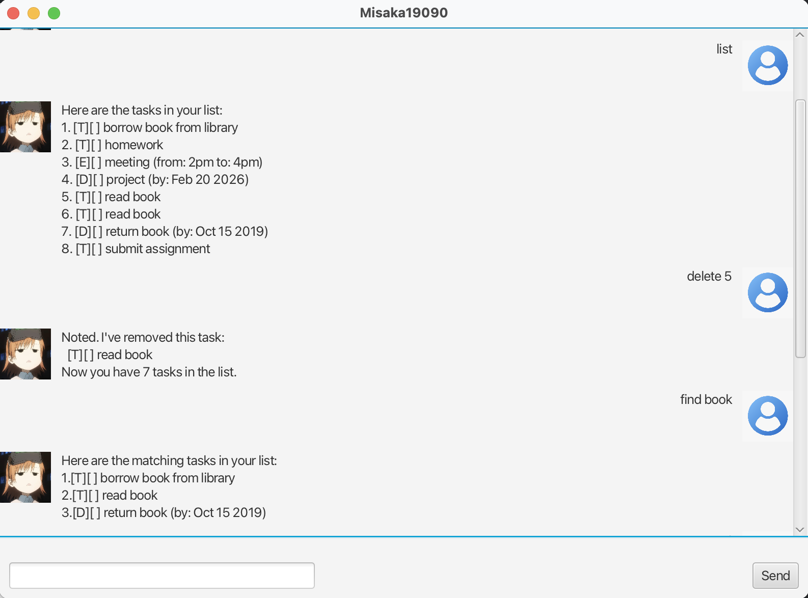

# Misaka19090 Chatbot User Guide

## Overview
Misaka19090 is a chatbot that interacts with users through a chat interface. 
Users can input commands and messages, and the chatbot will respond.

## How to Use
1. **Launch the App**: Run `Main.java` to start the GUI.
2. **Enter Messages**: Type your message in the text field and press `Enter` or click **Send**.
3. **Chatbot Responses**: Misaka appears on the left, and your messages appear on the right.
4. **Profile Pictures**: Both user and Misaka messages include profile images.
5. **Features**:
    - Add, delete, and list tasks.
    - View tasks within deadlines.
    - Sort tasks (if extension added).
    - All features accessible through chat commands.
6. **Scroll**: Chat window automatically scrolls when new messages arrive.

## Details of Features

#### 1. todo
Adds a task to the list 
*   **Format** `todo <description>`

---

#### 2. deadline
Adds a task which has a deadline to the list 
*   **Format** `deadline <description> /by <yyyy>-<MM>-<dd> `

---

#### 3. event
Adds a task which has a specific duration to the list 
*   **Format** `event <description> /from <start> /to <end>`

---

#### 4. list
Shows all the tasks in the list
*   **Format** `list`

---

#### 5. find
Shows all the tasks with the matching keyword
*   **Format** `find <keyword>`

---

#### 6. delete
Removes a certain task from the task list.
*   **Format** `delete <index>`

---

#### 7. mark
Marks a specific task as completed.
*   **Format** `mark <index>`

---

#### 8. unmark
Unmarks a completed task as uncompleted.
*   **Format** `unmark <index>`

---

#### 9. sort
Sorts all the tasks in the list based on alphabetical order.
*   **Format** `sort`

---

## Notes
- Ensure the JavaFX runtime is properly set up (Java 17 recommended).
- Input is ignored if blank.
