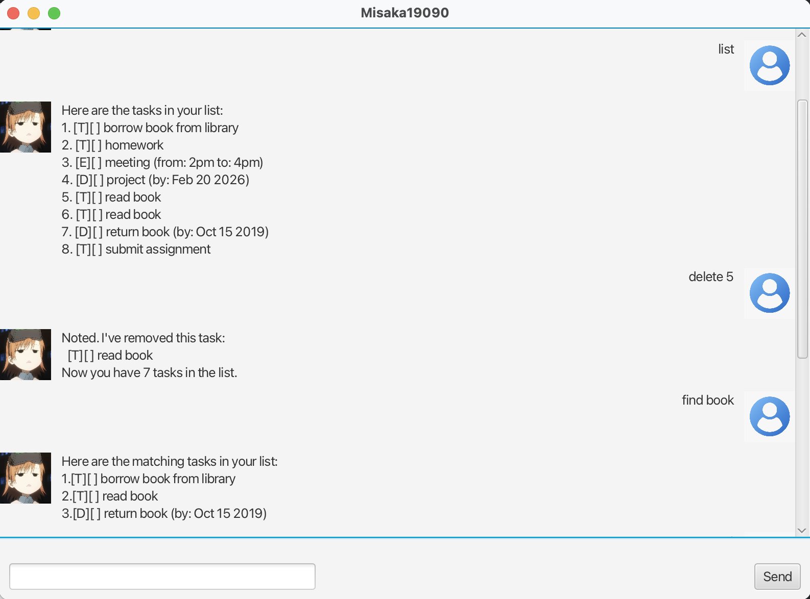

# Misaka19090 Chatbot User Guide

## Overview
Misaka19090 is a chatbot that interacts with users through a chat interface. 
Users can input commands and messages, and the chatbot will respond.

## How to Use
1. **Launch the App**: Run `Main.java` to start the GUI.
2. **Enter Messages**: Type your message in the text field and press `Enter` or click **Send**.
3. **Chatbot Responses**: Misaka appears on the left, and your messages appear on the right.
4. **Profile Pictures**: Both user and Misaka messages include profile images.
5. **Features**:
    - Add, delete, and list tasks.
    - View tasks within deadlines.
    - Sort tasks (if extension added).
    - All features accessible through chat commands.
6. **Scroll**: Chat window automatically scrolls when new messages arrive.

## Notes
- Ensure the JavaFX runtime is properly set up (Java 17 recommended).
- Input is ignored if blank.